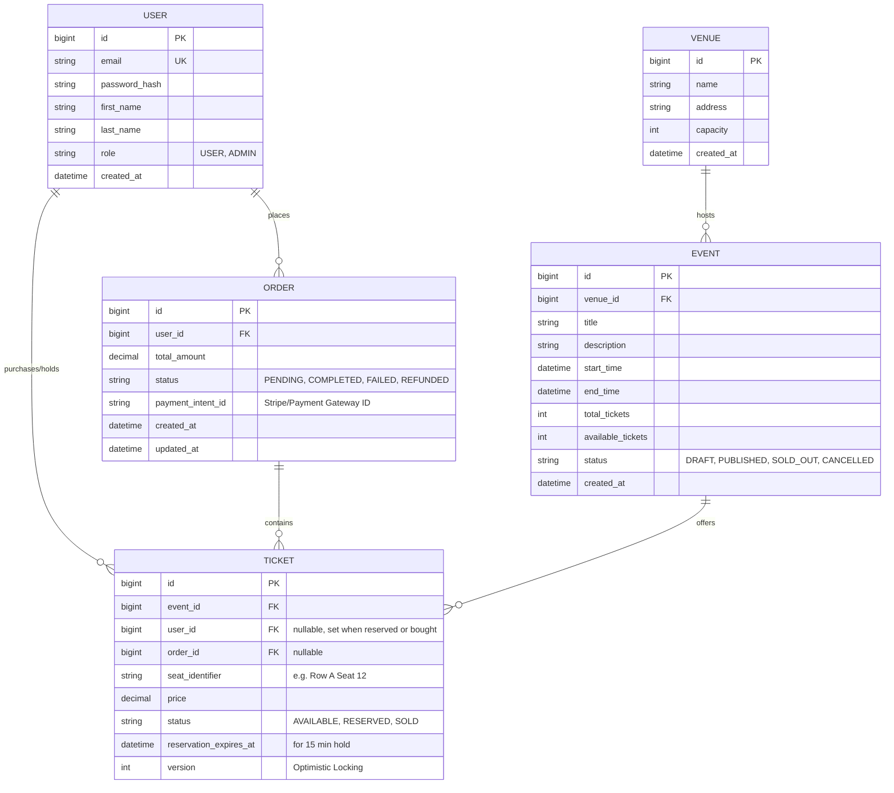

# FlashTix Database Schema Design

This document outlines the domain model and database schema for the FlashTix high-concurrency event ticketing system.

## Entity Relationship Diagram (ERD)

## Concurrency Handling Strategy

1. **Pessimistic vs. Optimistic Locking:**
   - The `TICKET` table includes a `version` column for **Optimistic Locking (@Version in Spring Data JPA)**.
   - When 10,000 users try to buy 100 tickets, only the first 100 transactions modifying a ticket's version successfully will commit. The rest will throw `OptimisticLockException` which we handle gracefully.

2. **Distributed Locks (Redis):**
   - For booking entire orders, we will utilize Redis distributed locks to prevent users from double-booking identical seats before hitting the DB.

3. **Database Isolation Level:**
   - Write operations (booking tickets) will require `READ COMMITTED` or `REPEATABLE READ` depending on the exact JPA strategy, to prevent dirty reads.
